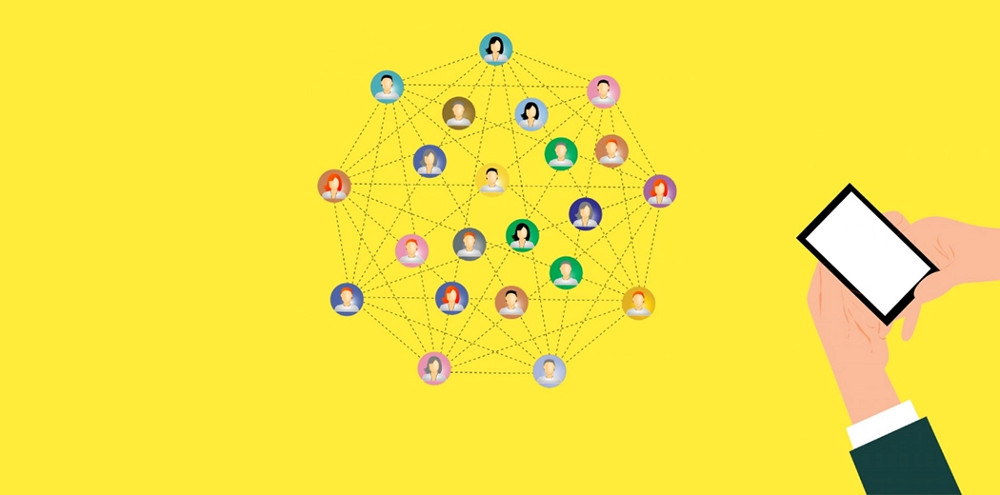
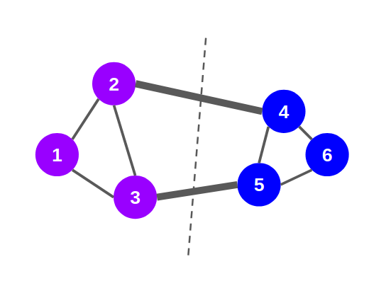
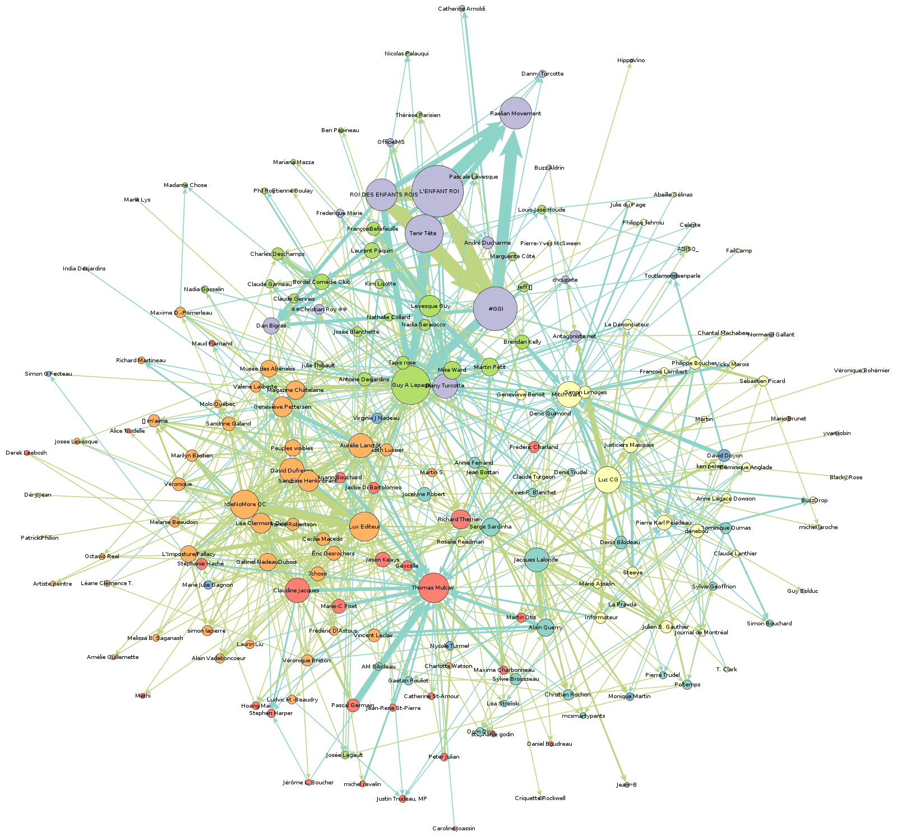
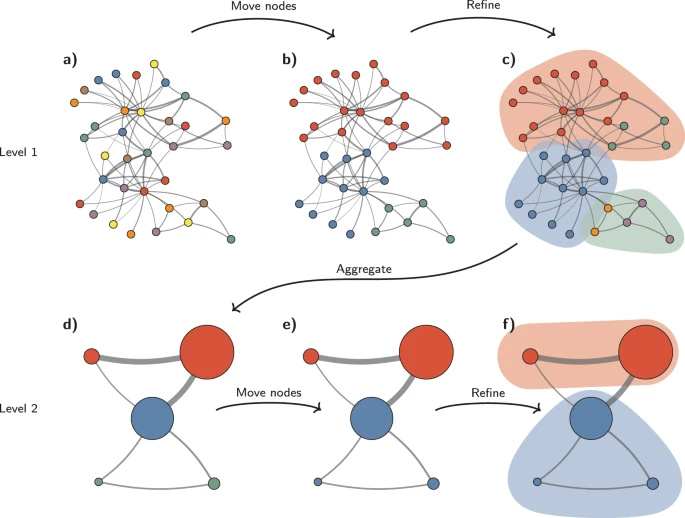

 

  

  <h3 align="center">Synthèse</h3>

  

    CDlib - Community Discovery Library
     
     
     
   
  

<!-- TABLE OF CONTENTS -->

  
Sommaire

  <ol>
    <li>
      <a href="#introduction">Introduction</a>
    </li>
    <li>
      <a href="#community-detection">Community Detection</a>
    </li>
    <li><a href="#algorithmes-de-résolution">Algorithmes de résolution</a><ul>
        <li><a href="#louvain-community-detection">Louvain Community Detection</a></li>
        <li><a href="#leiden-community-detection">Leiden Community Detection</a></li>
        <li><a href="#demon">Demon : Democratic Estimate of the Modular Organisation of a Network </a></li>
      </ul>
    </li>
    <li><a href="#intéret-de-CDLib">Intérêt de CDLib</a></li>
    
  </ol>

## Tuto

Nous avons hébergé notre tuto sur Github Pages : [Lien](https://khalidchbab.github.io/DataMining/ "Tuto")

## Introduction

Beaucoup d'entre vous connaissent les réseaux, n'est-ce pas ? Vous utilisez peut-être des sites de médias sociaux tels que Facebook, Instagram, Twitter, etc. Ce sont des réseaux sociaux. Vous avez peut-être affaire à des bourses de valeurs. Soit vous pourriez acheter de nouvelles actions, vendre ce que vous avez déjà, etc. Ce sont des réseaux. Non seulement dans le domaine technologique, mais aussi dans notre vie sociale quotidienne, nous avons affaire à de nombreux réseaux. Les communautés sont une propriété de nombreux réseaux dans lesquels un réseau particulier peut avoir plusieurs communautés de sorte que les nœuds à l'intérieur d'une communauté sont densément connectés. Les nœuds de plusieurs communautés peuvent se chevaucher. Pensez à votre compte Facebook ou Instagram et considérez avec qui vous interagissez quotidiennement. Vous pourriez interagir fortement avec vos amis, vos collègues, les membres de votre famille et quelques autres personnes importantes dans votre vie. Ils forment une communauté très dense à l'intérieur de votre réseau social.   
 

  

M. Girvan et M. E. J. Newman sont deux chercheurs réputés dans le domaine de la détection des communautés. Dans l'une de leurs recherches, ils ont mis en évidence la structure-propriété des communautés en utilisant les réseaux sociaux et les réseaux biologiques. Selon eux, les nœuds des réseaux sont étroitement connectés en groupes tricotés au sein des communautés et faiblement connectés entre les communautés.

(<a href="#top">back to top</a>)

## Community Detection

La détection des communautés dans un réseau est l'une des tâches les plus importantes de l'analyse de réseau. Dans un réseau à grande échelle, tel qu'un réseau social en ligne, nous pouvons avoir des millions de nœuds et d'arêtes. Détecter des communautés dans de tels réseaux devient une tâche herculéenne.

Par conséquent, nous avons besoin des algorithmes de détection de communautés qui peuvent partitionner le réseau en plusieurs communautés.

  

Il existe principalement deux types de méthodes pour détecter les communautés dans les graphes :

### `Agglomerative Methods`

Dans les méthodes agglomératives, nous commençons par un graphe vide composé de nœuds du graphe original mais sans arêtes. Ensuite, les arêtes sont ajoutées une par une au graphe, en commençant par les arêtes les plus "fortes" et les plus "faibles". La force de l'arête, ou le poids de l'arête, peut être calculée de différentes manières.

### `Divisive Methods`

Dans les méthodes de division, nous procédons dans l'autre sens. On commence avec le graphe complet et on enlève les arêtes de manière itérative. L'arête ayant le poids le plus élevé est retirée en premier. À chaque étape, le calcul du poids des arêtes est répété, car le poids des arêtes restantes change après la suppression d'une arête. Après un certain nombre d'étapes, nous obtenons des groupes de nœuds densément connectés.

## Algorithmes de résolution

Il existe de nombreuses techniques différentes proposées dans le domaine de la détection de communautés. Quatre algorithmes populaires de détection de communautés sont expliqués ci-dessous. Tous ces algorithmes peuvent être trouvés dans la bibliothèque python cdlib.

1.  Louvain Community Detection

L'algorithme de détection de communauté de Louvain a été proposé à l'origine en 2008 comme une méthode rapide de dépliage de communauté pour les grands réseaux. Cette approche est basée sur la modularité, qui tente de maximiser la différence entre le nombre réel d'arêtes dans une communauté et le nombre attendu d'arêtes dans la communauté. 

L'algorithme tente de maximiser son objectif en répétant ces deux phases :

  * Il affecte chaque nœud du graphe à une seule communauté. Pour chaque arête reliant le nœud u et le nœud v, l'algorithme vérifie si la fusion des communautés de u et v augmente l'objectif, et si oui, il effectue la fusion.
  * L'algorithme construit un nouveau graphe, où chaque communauté est représentée par un seul nœud, et le poids attribué à l'arête entre les communautés est la somme des poids de toutes les arêtes entre les nœuds fusionnés de chaque communauté.

L'algorithme s'arrête lorsqu'il n'y a aucune étape qui augmente l'objectif. La sortie est un graphe induit, où les nœuds représentent les communautés.

  
  
Sous-réseau d'interactions sociales sur Twitter, usant de la méthode louvain pour détecter des "communautés"

2.  Leiden Community Detection

La détection de communautés est souvent utilisée pour comprendre la structure des grands réseaux complexes. L’un des algorithmes les plus populaires pour découvrir la structure de la communauté est le soi-disant algorithme de Louvain. Traag et al. ont montré que cet algorithme a un défaut majeur qui est largement passé inaperçu jusqu’à présent : l’algorithme de Louvain peut produire des communautés arbitrairement mal connectées. Dans le pire des cas, les communautés peuvent même être déconnectées, en particulier lors de l’exécution itérative de l’algorithme. 

Pour résoudre ce problème, Traag et al. ont introduit l’algorithme de Leiden. Ils ont prouvé que l’algorithme de Leiden produit des communautés qui sont garanties d’être connectées. En outre, ils ont prouvé que, lorsque l’algorithme de Leiden est appliqué de façon itérative, il converge vers une partition dans laquelle tous les sous-ensembles de toutes les communautés sont assignés localement de façon optimale. De plus, en s’appuyant sur une approche de déplacement local rapide, l’algorithme de Leiden fonctionne plus rapidement que l’algorithme de Louvain et découvre de meilleures partitions, en plus de fournir des garanties explicites.

  
  
   Algorithme de Leiden : L’algorithme de Leiden part d’une partition simple (a). L’algorithme déplace les noeuds individuels d’une communauté à une autre pour trouver une partition (b), qui est ensuite affinée (c). Un réseau d’agrégats (d) est créé sur la base de la partition raffinée, en utilisant la partition non définie pour créer une partition initiale pour le réseau d’agrégats. Par exemple, la communauté rouge en b) est raffinée en deux sous-communautés en c), qui, après agrégation, deviennent deux nœuds distincts en d), tous deux appartenant à la même communauté. L’algorithme déplace ensuite les nœuds individuels dans le réseau d’agrégats (e). Dans ce cas, le raffinement ne modifie pas la partition (f). Ces étapes sont répétées jusqu’à ce qu’aucune autre amélioration ne soit apportée.

3.  Demon : Democratic Estimate of the Modular Organisation of a Network 

La détection de communautés dans des réseaux complexes est un problème intéressant avec un certain nombre d’applications, en particulier dans la tâche d’extraction de connaissances dans les réseaux sociaux et d’information. Cependant, de nombreux grands réseaux manquent souvent d’une organisation communautaire particulière au niveau mondial. Dans ces cas, les algorithmes traditionnels de partitionnement graphique ne laissent pas émerger les connaissances latentes intégrées dans la structure modulaire, car ils imposent une vision globale descendante d’un réseau.

Demon est proposé pour remédier à ce problème, cet algorithme repose sur une approche simple et locale de la découverte de la communauté, capable de dévoiler l’organisation modulaire de réseaux réellement complexes. Ceci est réalisé en laissant démocratiquement chaque noeud voter pour les communautés qu’il voit l’entourer dans sa vision limitée du système global, c.-à-d. son voisinage ego, à l’aide d’un algorithme de propagation d’étiquette ; enfin, les communautés locales sont fusionnées dans une collection globale.

## Intérêt de CDLib

Bien que de nombreuses méthodes et algorithmes aient été proposés pour résoudre un problème de "Community Detection", ainsi que des questions connexes telles que leur évaluation et leur comparaison, peu d'entre eux sont intégrés dans un cadre logiciel commun, ce qui rend leur utilisation, leur étude et leur comparaison difficiles et fastidieuses.

Seule une poignée des méthodes les plus célèbres sont disponibles dans des bibliothèques génériques telles que NetworkX et Igraph, et l'exécution de toute autre méthode nécessite de :

 1. Trouver une implémentation fiable.
 2. Apprendre à l'utiliser.
 3. Transformer le graphique à étudier dans le format demandé.
 4. Exporter et transformer le clustering résultant dans un format adapté aux besoins de l'utilisateur.

Ce processus laborieux est probablement la cause de deux fortes faiblesses du domaine de la `Community Detection` :

 * Malgré le grand nombre d'algorithmes publiés chaque année, la plupart des nouveaux algorithmes proposés ne sont comparés qu'à quelques méthodes classiques.

* Les praticiens n'essaient presque jamais différentes méthodes sur leurs données, alors qu'il est bien connu dans le domaine que différentes méthodes fournissent souvent des solutions très différentes.

Pour faire face à ces problème, nous introduisons une nouvelle bibliothèque - `CDLib` - conçue pour sélectionner/appliquer facilement des méthodes de découverte de communautés sur des ensembles de données de réseau, évaluer/comparer le clustering obtenu et visualiser les résultats.

CDLIB est utilisé pour simplifier la définition/exécution/évaluation de l'analyse de la Community detection. 

Les principales caractéristiques de la bibliothèque sont les suivantes.

* Implémentation d'un large éventail d'algorithmes pour la détection de communautés, y compris les méthodes de chevauchement, les méthodes floues et les regroupements de bords.

* Représentation standardisée pour les graphes et les regroupements.

* Des outils pour comparer efficacement les méthodes en faisant varier leurs paramètres, ou les méthodes entre elles.

* Implémentation d'une variété de scores et de fonctions de qualité pour évaluer la qualité des communautés individuelles et des regroupements entiers.

* Des outils de visualisation pour comparer et analyser les clusters obtenus par une ou plusieurs méthodes.
